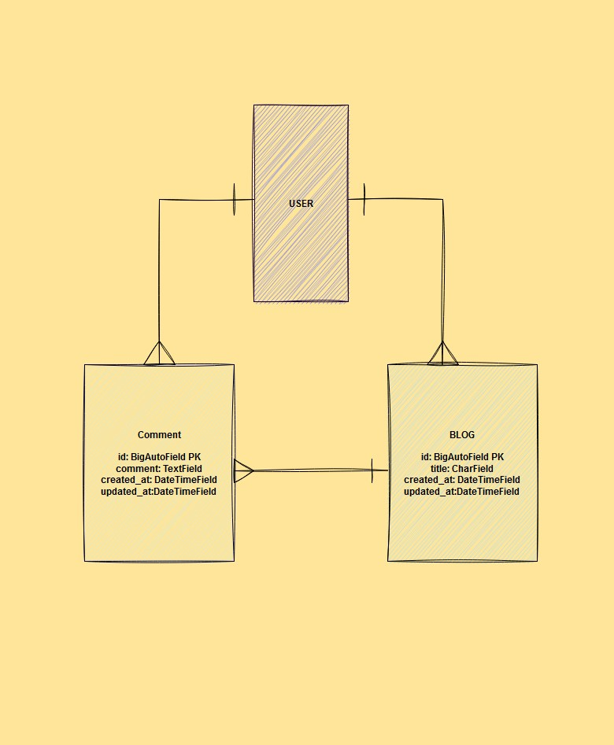
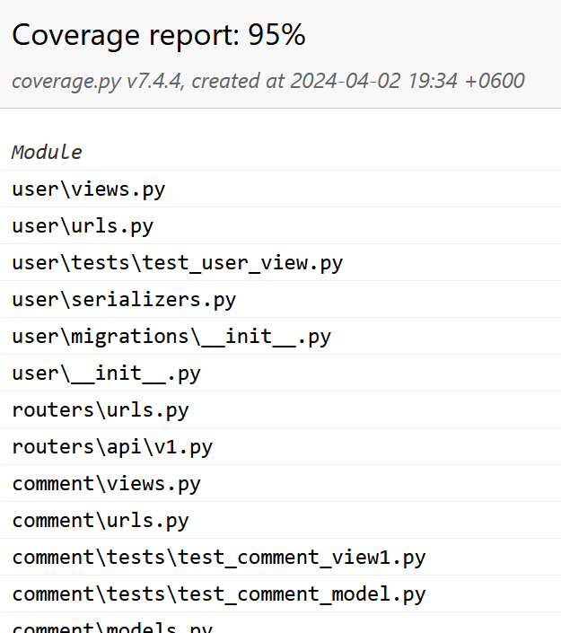
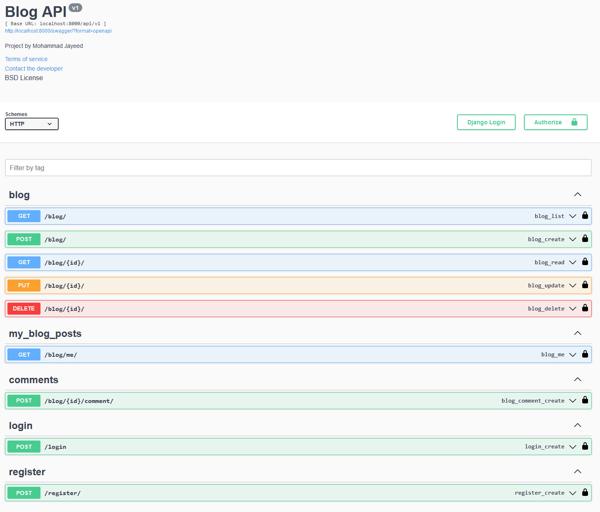

## Docker Installation
- Make sure you have docker installed on your machine
- Clone the [repository](https://github.com/mohammadjayeed/blog-management-system.git)
- From the terminal, input these commands:
```bash
  docker-compose up
```
- Finally create a superuser (if you would like to) with the following commands:
```bash
  docker exec -it <container_id_or_name> /bin/bash
```
A prompt will show up. Type:
```bash
  python manage.py createsuperuser
```
- Provide user credentials as necessary
- You can now access **[127.0.0.1:8000/swagger](http://127.0.0.1:8000/swagger)** to check the running project

### Swagger Management Flow:
- Register > Login > Copy access token > Put inside Authentication bar as :
```bash
  Bearer <access_token>
```
- Now perform all the CRUD operations accordingly.

### Running testcases inside docker container
```bash
  docker exec -it <database_container_id_or_name> /bin/bash
```
```bash
  mysql -u root -p
```
- Provide database container password
- Once mysql> shows up, execute the following commands sequentially:

```bash
  GRANT ALL PRIVILEGES ON mydatabase.* TO 'user'@'%';
```
```bash
  GRANT ALL PRIVILEGES ON `test\_mydatabase`.* TO 'user'@'%';
```
```bash
  FLUSH PRIVILEGES;
```
  Now exit the database container

- Finally you can enter the app container:
```bash
  docker exec -it <container_id_or_name> /bin/bash
```
  And run pytest command as follows:
```bash
  pytest
```

## Local Installation

### Make sure to configure database in blog_restful > settings.py

## Step 1 - Repository
- Clone the following [repository](https://github.com/mohammadjayeed/blog-management-system.git),
```bash
  git clone  https://github.com/mohammadjayeed/blog-management-system.git
```
## Step 2 - Virtual Environment
- Make a virtual environment with the following command
```bash
  python -m venv venv
```
-  Activate the virtual environment with the command
```bash
  venv/scripts/activate  or  venv/bin/activate (for linux)
```
## Step 3 - Dependencies
- Install dependencies
```bash
  pip install -r requirement.txt
```
## Step 4 - Migrations
- Run the following command to apply it to the database
```bash
  python manage.py migrate
```
## Step 5 - Superuser
- Run the following command to create a superuser to access admin panel by adding the required information. We will require username and password to login to the admin panel
```bash
  python manage.py createsuperuser
```
## Step 6 - Start App
- Start the application by typing the following command
```bash
  python manage.py runserver
```
## Step 7 - Testing the App
- Test the application for models and views by typing the following command
```bash
  pytest
```
### Testing the coverage
Either
```bash
  pytest --cov .
```
Or
```bash
pytest --cov-report html --cov .
```

### ERD Diagram


### Coverage Snapshot


### Project Documentation Sample
